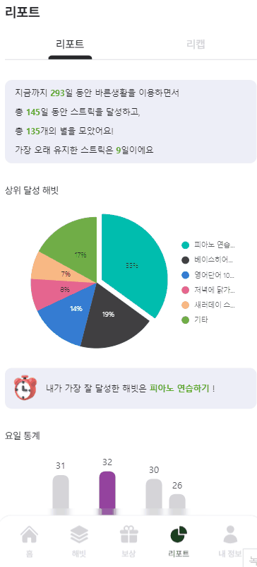

# 🥇 바른생활 
사람들과 경쟁하고 비교하는 삶에서 벗어나 자신의 습관을 기록하고 유지하며 집중할 수 있도록 도와주는 해빗 트래커 웹 애플리케이션

## Stacks
### Backend

### Frontend

### Database

### Infra

### IDE

### Management Tool

## 1. 기획 배경
- 숏폼의 등장으로 한 가지 일을 꾸준히 하지 못하게 됨
- SNS로 인해 타인의 삶을 신경쓰느라 정작 본인의 삶에 집중하지 못하는 경우가 많음
- 꾸준히 습관을 유지하는 피로함을 즐거움으로 바꿀 수 있는 수단 필요

## 2. 페르소나
- 건강한 습관을 만들고 싶은 사람
- 어떤 습관을 설정해야 할지 잘 모르는 사람
- 자신의 습관을 타인과 비교하거나 비교당하고 싶지 않은 사람
- 혼자 습관을 유지하기에 의지가 부족한 사람
- 본인의 습관 실천 내역을 기록 및 요약하고 싶은 사람

## 3. 기능
### 메인 화면

|  |  |  |  |
| :----------------------------------------------------------------------------------: | :---------------------------------------------------------------------------------: | :---------------------------------------------------------------------------------------: | :--------------------------------------------------------------------------------------: |
|                                 **로딩 화면**                                 |                               **메인 화면**                                |                           **프로필 화면**                            |                                  **해빗 별 스트릭 확인 화면**                                  |

- 사용자 스트릭
    - 각 날짜마다 주어진 해빗 스트릭 중 하나라도 수행하면 채워짐
    - 달성한 습관의 갯수에 따라 색상 차이가 존재
- 해빗 스트릭
    - 각 해빗마다 별개의 스트릭이 존재
    - 해빗을 선택하면 달성한 날짜와 달성하지 못한 날짜, 스트릭 수, 달성 비율 확인 가능

### 해빗 트래커

|  |  |  |  |
| :----------------------------------------------------------------------------------: | :---------------------------------------------------------------------------------: | :---------------------------------------------------------------------------------------: | :--------------------------------------------------------------------------------------: |
|                                 **해빗 목록 화면**                                 |                               **해빗 트래커 리스트 화면**                                |                           **해빗 트래커 완료 화면**                            |                                  **해빗 편집 화면**                                  |

- 사용자가 초기에 한 달을 기준으로 습관 3개, 포인트로 구매하여 최대 7개까지 설정 가능
- 사용자들이 선호하는 습관 카테고리를 추천해주며, 습관 이름과 날짜를 설정하여 등록
- 등록된 해빗 트래커는 해당 날짜에 실천한 내용과 사진을 추가하여 완료
- 한 달이 끝나면, 사용자가 한 달간 어떤 습관을 실천했는지 요약 및 정리(리캡)

### 상품 구매 및 적용

|  |  |  |  |
| :----------------------------------------------------------------------------------: | :---------------------------------------------------------------------------------: | :---------------------------------------------------------------------------------------: | :--------------------------------------------------------------------------------------: |
|                                 **상품 구매 목록 화면**                                 |                               **랜덤 포인트 수령 화면**                                |                           **스트릭 및 나무 상품 구매 화면**                            |                                  **스트릭 리커버리 구매 화면**                                  |

- 스트릭 유지할 경우 기본 포인트 제공
- 여러 개의 해빗 달성, 일정 기간 스트릭 유지할 경우 등 추가 포인트 부여
- 포인트 획득시 자동으로 잔고에 쌓이지 않고 나무에 열매가 열리는 형태로 적립되며, 사용자가 열매를 수확하는 방식으로 획득 가능
- 아이템 구매에 사용 가능
    - “스트릭 복구” : 미 수행 후 하루가 지나 기본적인 추가 스트릭 유지가 불가할 때 과거 스트릭을 복구할 수 있음
    - “추가 해빗” : 해빗 트래커의 기본 습관 개수는 3개 → 최대 7개까지 확장 가능
    - “스트릭 테마” : 랜덤으로 스트릭 테마 색상 변경 가능

### 리포트

|  |  |  |  |
| :----------------------------------------------------------------------------------: | :---------------------------------------------------------------------------------: | :---------------------------------------------------------------------------------------: | :--------------------------------------------------------------------------------------: |
|                                 **사용자 리포트 화면**                                 |                               **리포트 상호작용 화면**                                |                           **리캡 목록 화면**                            |                                  **리캡 상세화면**                                  |

- 한 달 주기로 스트릭 전체 기록, 이번 달 최장 스트릭, 이번 달 가장 많이 기록한 습관 등 습관 달성 내용을 그래프 등의 시각적 도구로 요약
- 가장 많이 기록한 습관의 내용과 사진 등은 요약하여 표시
- 지난 리캡 기록은 추후 재열람 가능

 

## 4. 기대효과 & 향후 전망

### 기대효과

- 과열된 경쟁 사회에서 자신에게 집중할 수 있는 환경 제공
- 포인트, 아이템 등의 게이미피케이션 도구를 통해 서비스 장기 이용 및 꾸준한 습관 유지
- 습관을 유지하면 일상적인 활동이 자동화되어 시간과 에너지를 절약할 수 있음. 일상적인 작업을 효율적으로 처리하고 더 많은 일을 해낼 수 있게 함
- 일정한 습관을 만들면 특정 목표를 달성하기 더 쉬워지며 이상은 예측 가능하고 안정적이게 되기 때문에 스트레스가 감소

### 향후전망

- 다른 앱(피트니스 등) / 스마트 워치와 연동하여 달성 여부 자동 체크
- 사용자의 습관 패턴을 파악해 주로 달성하는 시간에 습관 달성 권장 알림
- 애플리케이션 사용자들의 데이터 분석을 통하여 개인화된 사용자에게 습관 추천
- 습관 내역을 제공하여 전문가에게 습관 코칭

# 설계 내용

## ERD

## 아키텍쳐

 

# 팀원 소개

| **Profile**  |  |  |  |  |  |  |
| :----------: | :---------------------------------------------------------------: | :---------------------------------------------------------------: | :---------------------------------------------------------------: | :---------------------------------------------------------------: | :---------------------------------------------------------------: | :---------------------------------------------------------------: |
|   **Name**   |      <a href='https://github.com/HyeongjinKim98'>김형진</a>       |         <a href='https://github.com/YooHyunJi'>유현지</a>         |        <a href=''>장수민</a>         |         <a href=''>전영빈</a>          |         <a href=''>신종욱</a>          |          <a href='https://github.com/HiWoong'>곽희웅</a>          |
| **Position** |                      Frontend                       |                      Frontend                       |                             Part Leader & Frontend                              |                       Backend & Infra                         |                              Part Leader & Backend                              |                          Team Leader & Backend                        |

## 업무 분장

### Frontend

- 유현지: 
- 김형진 :
- 장수민 :

### Backend

- 전영빈 : 
- 신종욱 : 
- 곽희웅 : 
